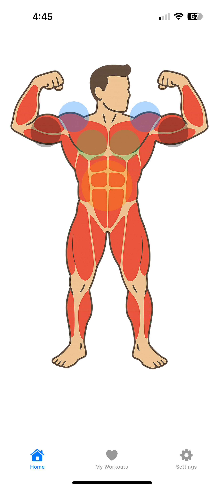
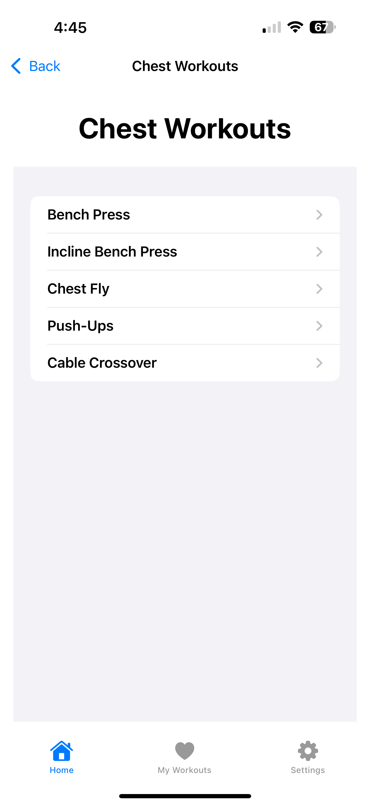
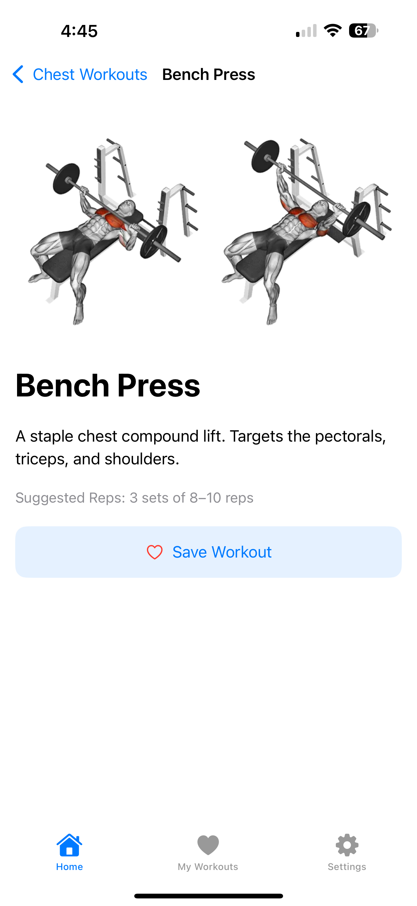
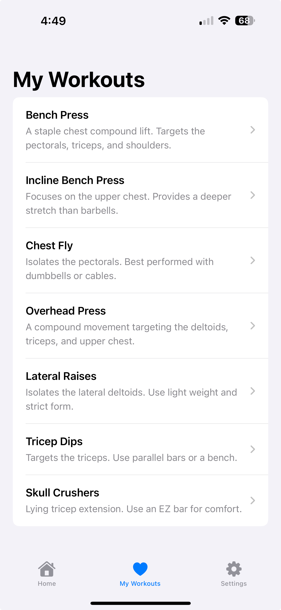

# GymBros 🏋️‍♂️

**GymBros** is a native iOS fitness app built with Swift and SwiftUI. It helps users discover and save personalized gym workouts by tapping on different parts of an interactive human body diagram. The app is designed for simplicity, motivation, and tracking — perfect for gym-goers who want focused, visual workout guidance.

> ⚠️ Work in progress — additional features, backend integration, and UI polish still in development.

---

## 📱 Features

- 🔍 **Body-Part Based Workout Selection**  
  Tap on the human body diagram to choose a muscle group (shoulders, chest, arms, etc.).

- 📋 **Curated Workout Lists**  
  View detailed workouts with:
  - Image or video demo  
  - Muscle group targeting  
  - Suggested reps  
  - "Save" or "Unsave" toggle

- 💾 **My Workouts Tab**  
  - Saved workouts persist across sessions using `UserDefaults`
  - View, open, or delete workouts with a swipe gesture

- 🧭 **User Navigation**  
  - `WorkoutListView`, `WorkoutDetailView`, and `MyWorkoutsView` built with SwiftUI navigation patterns
  - Clean transitions and reusable components

---

## 🛠 Tech Stack

- **Language:** Swift  
- **Framework:** SwiftUI  
- **Storage:** UserDefaults  
- **Platform:** iOS (Xcode project)

---

## 🧪 In Progress & Planned Features

- ✅ Interactive body diagram & workout detail views  
- ✅ Save and delete workouts (persistence)  
- 🟡 Expand media support (YouTube previews or gifs)  
- 🟡 Add more muscle groups and workout content  
- 🟡 Build a backend to store user accounts and custom plans  
- 🟡 Add social features or daily reminders  
- 🟡 Dark mode and visual polish  

---

## 📸 Screenshots 

| Body Diagram | Workout List | Workout Detail | My Workouts |
|--------------|--------------|----------------|-------------|
|  |  |  |  |

---

## 🧭 Getting Started

1. Clone this repo:  
   `git clone https://github.com/zaksheikh/gymbros-app.git`
2. Open `GymBros.xcodeproj` in Xcode  
3. Run on iOS Simulator or physical device (iOS 15+ recommended)

---

## 📂 Project Structure

gymbros-app/
├── GymBros/ # Main Xcode project folder
│ ├── GymBros.xcodeproj # Xcode project file
│ ├── GymBros/ # Source files (Views, Models, Assets)
│ ├── GymBrosTests/ # Unit tests
│ └── GymBrosUITests/ # UI tests
├── README.md # Project overview and documentation
├── docs/ # Planning and design documents
│ ├── GBFunctions.md
│ ├── GBInteractions.md
│ ├── GBInterface.md
│ ├── GBScenarios.md
│ ├── GBinterface.png
│ └── GBinterface3.png
├── screenshots/ # App screenshots used in README
│ ├── BodyFront.png
│ ├── body.png
│ ├── detail.png
│ ├── list.png
│ └── saved.png

---

## 📌 About the Developer

**Zak Sheikh**  
Aspiring software engineer passionate about fitness tech, mobile UX, and building tools that help people stay consistent.  
- [LinkedIn](https://www.linkedin.com/in/zak-sheikh-1535412aa)  
- Email: zaksheikh45@gmail.com

